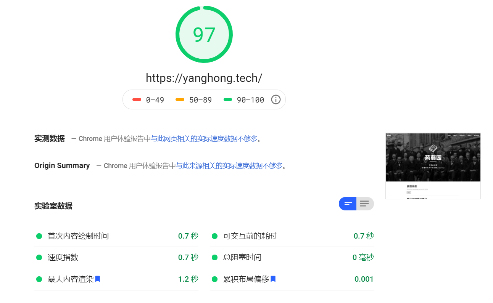
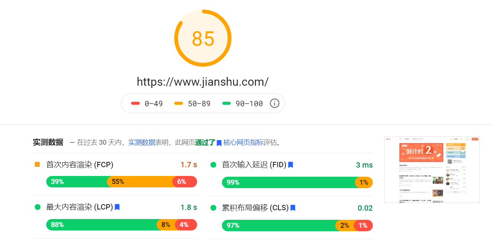

优化了一下网站的访问速度。主要是按照 PageSpeed Insight 的分数为标准优化的：
[测试网站](https://developers.google.com/speed/pagespeed/insights/?url=)

几个星期前的测试结果大概是主页65分，文章只有二三十分，那时候我还没有添加live2D到网页上啊 {{site.han}}。
现在稍微调整了一下分数就变高了许多。

**主页：**



**含数学公式的文章：**


速度被 mathjax 拖累也没办法了，总是要用的 {{site.bugaoxing}}

**不含数学公式的文章：**


优化还是很明显的。

对比一下简书的速度：



吊打之 {{site.huanhu}}

---


# 优化方法

只做了一点小动作就提高了很多分数了。

## 修改外部链接

很多 js,css 文件用的都是国外的 cdn，访问链接就要几百毫秒了，把链接都改成国内的 cdn 可以快很多。
不过这个优化应该在 PageSpeed 的分数上体现不出来。

+ 	mathjax bootcss cdn:
	[https://cdn.bootcss.com/mathjax/2.7.7/MathJax.js?config=TeX-AMS-MML_HTMLorMML](https://cdn.bootcss.com/mathjax/2.7.7/MathJax.js?config=TeX-AMS-MML_HTMLorMML)

+	font-awesome 七牛 cdn:
	[https://cdn.staticfile.org/font-awesome/4.2.0/css/font-awesome.min.css](https://cdn.staticfile.org/font-awesome/4.2.0/css/font-awesome.min.css)

+ 	jQuery 七牛 cdn:
	[https://cdn.staticfile.org/jquery/2.1.4/jquery.min.js](https://cdn.staticfile.org/jquery/2.1.4/jquery.min.js)

+	Bootstrap bootcss cdn:
	[https://cdn.bootcss.com/bootstrap/3.3.5/js/bootstrap.min.js](https://cdn.bootcss.com/bootstrap/3.3.5/js/bootstrap.min.js)

## 预加载

一开始我还不知道预加载这回事，但是看浏览器 warning 里有说我预加载了但是没有使用 {{site.heixian}}，
查了一下发现网页资源可以预加载。那就给博客加上去8 {{site.taikaixin}}

预加载格式：

```html
<link rel="preload" href="/img/star.jpg" as="image">
```

要注意指定资源的类型。

有很多资源，都是每个页面都要使用的，直接加到预加载里就好了。
不过预加载太多东西反而会因为加载内容过大使分数降低。


## 图片压缩

我的博客里的图还是挺多的，每篇文章一张背景图，live2D也要加载很大的图片资源。
所以压缩一下图片还是有显著提升的。


+   [photopea](https://www.photopea.com/) 
	一个在线 Photoshop 的网站。导出时可以改变图片的分辨率，也可以压缩。

+	[picdiet](https://www.picdiet.com/zh-cn)
	在线压缩图片的网站，压缩效率还挺高的。 不过只支持jpg,  而且不能调整分辨率。
	

我把每张图片都压缩到了 200KB 以下， 访问速度就有显著提升了。

## js Lazyload

调整以下 js 的执行顺序，防止js阻塞进程。

---

一开始打算直接用 cloudflare 的功能来优化。
开了 cloudflare 的 Rocket Loader 之后 PageSpeed 的分数提高的还是挺明显的，
可惜国内不挂代理的话根本没办法访问cloudflare提供的 rocketloader.js。 
虽然 PageSpeed 分数很高，但是国内根本访问不了了。